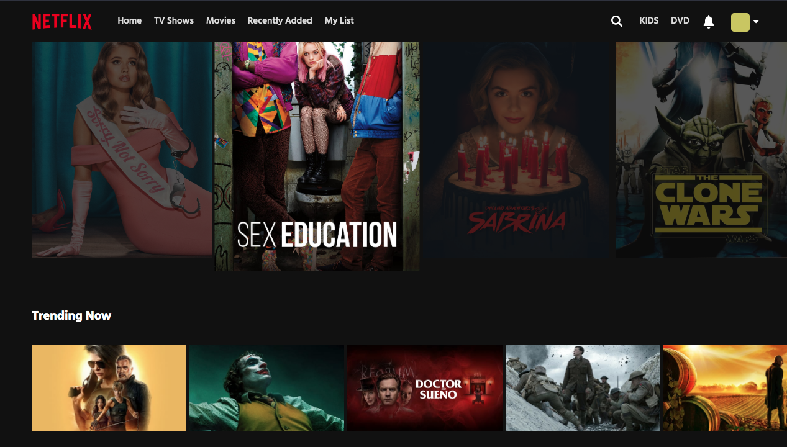

# Netflix Clone (Frontend)

:movie_camera: This project is a simplified front end clone of Netflix. It was created with React and CSS (Grid and Flexbox). It uses [The MovieDB Api](https://www.themoviedb.org/documentation/api) to search for movies and display details.

### [Live Demo](http://relirk-netflix.surge.sh/)



### Tools used:
- Webpack
- Axios
- Redux & React
- Sass (grid & flexbox)
- Media queries

### User Stories: 

- User can search for movies and TV shows on TMDb
- User can the see upcoming and trending movies. Data updates weekly 
- User can click on a movie and a modal should pop up. It should display the title, release date, overview, and runtime.  
- The webpage adapts to any screen size. 

### Video Walktrough 


### Running Locally
```sh
# Install dependencies
yarn install

# Start the app on a new window
yarn start
```
